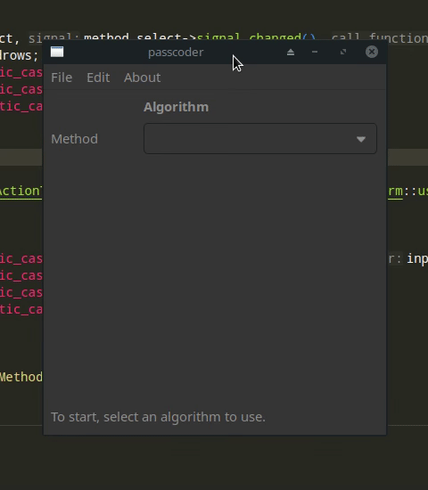

# GTK Passcoder

**GTK Passcoder is a simple C++ GUI tool for encryption and hashing, providing OpenSSL algorithm access with an easy to use GTK3 interface.**

## Table of Contents

**GTK Passcoder**
+ [Demo](#demo)
+ [Features](#features)
+ [Quick Start](#quick-start)
+ [Installation](#installation)
+ [Build](#build)
+ [Usage](#usage)
+ [License and Contributing](#license-and-contributing)

**Project Structure**
+ [Random Strings](#random-strings)

## Demo



## Features

+ User-friendly GUI with GTK3, using Glade and Builder.
+ OpenSSL algorithms for encryption and hashing (will add more).
+ Persistent settings, including window size and random string generator options.
+ Random string generator using STL Mersenne Twister implementation, and many different string generators.

## Quick Start

```bash
# Clone the repository
git clone https://github.com/your_username/passcoder.git
cd passcoder

# Build the project
mkdir build
cd build
cmake ..
make
```

## Installation

Make sure you have the following dependencies installed, with minimum version:
+ GTKmm 3.0
+ Boost 1.70
+ OpenSSL 1.1.0
+ CMake 3.12

For Debian-based systems:
```bash
sudo apt-get install libgtkmm-3.0-dev libboost-all-dev libssl-dev cmake
```

## Build

To build, simply run `./build.sh` and the `build` folder will be populated by the application structure. The most recent build will also be stored, zipped, in the project root after running the shell script, for ease of use.

Once built, the build structure will be the following:
+ `res` folder containing various data used by the application,
+ `ui` folder containing the layout of the GUI, using Glade XML format.

## Usage

In the `build` folder, simply run the application using `./passcoder` after building.

## License and Contributing

The project is licensed under the BSD 3-Clause License. Feel free to contribute! I am welcome to suggestions and improvements.

---

# Project Structure

## Random Strings

The random string generator is encapsulated in the `MemorableStringGen` class, in `memorable.hpp` and `memorable.cpp`.

It currently allows generating:
+ Adjective + Noun
+ Noun spelled with the phonetic alphabet
+ Random spelled phonetic alphabet
+ Random spelled numbers
+ Random hexadecimal string
+ Random ASCII string

Each setting has its own configuration bars in the settings menu.

In addition, the Leet factor is available to replace random characters with numbers, with chance to occur editable in settings.

##

**To be documented in further detail...**
